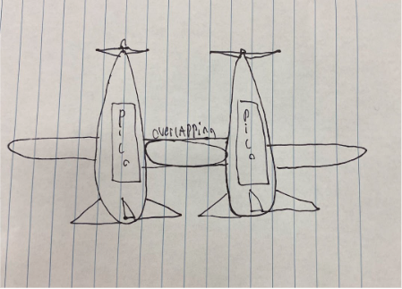

# PLAIN
(**P**)ropelled (**L**)inkage (**A**)ircraft (**I**)ntercommunication (**N**)ighthawk

&nbsp;

## Table of Contents
* [Foundation](#foundation)
* [Scheduling](#schedule)
* [Initial_Sketches](#initial_sketches)
* [List_Of_Materials](#list_of_materials)
* [Code_Block_Diagram](#code_block_diagram)
  
&nbsp;

## Foundation

### Scope
The goal of the project is to work with Afton and Matthew in order to create 2 planes that take off linked together and then split into 2 different planes after receiving the signal. Once the planes detach, each group will take their own readings of either altitude, pressure, temperature, max height, max tilt, or length of flight. We have split this project into 4 stages for our group. The first stage will be creating a body that can glide without a motor and produce some sort of lift. The next stage will include a motor and prop, and we will achieve a solo takeoff. Stage 3 is a successful attaching and detaching mechanism with our sister aircraft. The last stage is linked takeoff and detachment in the air while collecting data.

### Our definition of "Success"
A successful project for us is one that can produce lift, takeoff while attached to our sister plane, detach from that sister plane, collect data from an accelerometer, and not crash land/break on impact. We also want to be safe while working on our project and this requires strict risk mitigation.

### Risk Mitigation
We want to be safe by making sure the zone under the flight path is clear just in case of debris or failure. We will wear safety glasses and all necessary PPE to prevent the motors throwing things into our eyes. We will not fly the PLAIN so that there is a change ending up in a powerline or a road. We will store our PLAIN in an appropriately sized place and never leave the batteries connected while in storage. We will only take off from an open field where there are no obstacles for the PLAIN to crash into. 

### What we need to learn
We need to figure out the following: How does RC work and how should the pico interpret those signals? How big does the prop need to be and how powerful + lightweight of a motor do we need to create liftoff? What type of airfoil is the best for an RC plane of our size and weight? How do we make the connected wings into a functional airfoil? Does an RC plane of our size and weight need ailerons on both the main wings and tail wings? What is the angle of attack where an RC plane with our chosen airfoils starts to stall?

## Schedule

### Planning:
Week 1 (12/1-12/8) planning 

Week 2 (12/11-12/15) finish Planning 

Week 3 (1/2-1/5) prototype body with shop materials 

### Stage 1:
Week 4 (1/8-1/12) Prototype body within CAD

Week 5 (1/15-1/19) Start Code for servos and refine CAD + RC connection

Week 6 (1/22-1/26) Print and assemble first prototype

### Stage 2:
Week 7 (1/29-2/2) Work out kinks in prototype, plan for motor/prop

Week 8 (2/5-2/9) work on code and CAD V2 (with motor)

### Stage 3:
Week 9 (2/12-2/16) Start working with afton’s team on linkage, start those CAD parts

Week 10 (2/19-2/23) Code the delink protocol and complete prototype with link

Week 11 (2/26-3/1) Touch up delink/motor/rc, figuring out weight, first successful solo flights

### Stage 4:
Week 12 (3/4-3/8) Plan with Afton’s team for linked takeoff, modify CAD/code if needed

Week 13 (3/11-3/15) Test linked takeoff, find issues and fix, test accelerometer data

Week 14 (3/18-3/22) Test detachment protocols in air, find issues and fix

Week 15 (3/25-3/29) Last minute fixes and touch ups, prepare for launch

### Launching:
Week 16 (4/1-4/5) Launch PLAIN and collect data/watch other projects launch

Week 17 (4/8-4/12) Launch PLAIN and collect data/watch other projects launch

Week 18 (4/15-4/19) Launch PLAIN and collect data/watch other projects launch

### Analysis:
Week 19 (4/22-4/26) Analyze data collected and document

Week 20 (4/29-5/3) Analyze data collected and document

Week 21 (5/6-5/10) Analyze data collected and document

Week 22 (5/13-5/17) Finishing touches on whatever criteria needed

## Initial_Sketches

## List_Of_Materials

|Material|Amount|Cost|
|------|---------|---------|
|Pico|1x|$5|
|Servo|4x|$20|
|Hot Glue|1 stick|$1|
|Carboard|2 sheets|$2|
|Bolts|10x|$1 |
|Accelerometer|1x|$3|
|RC kit|1x|$10|
|Breadboard|1x|$2|
|Jumper wires|30x|$5|
|Acrylic|1 sheet|$2|
|Nuts|10x|$1|
|Balsa wood|2 sheets|$5|
|TOTAL| |$57|

## Code_Block_Diagram

