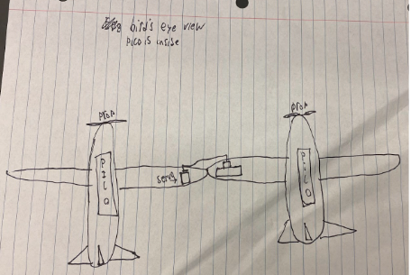

# PLAIN
(**P**)ropelled (**L**)inkage (**A**)ircraft (**I**)ntercommunication (**N**)ighthawk

&nbsp;

## Table of Contents
* [Planning](Planning.md)
* [Phase 0](#phase_0)
* [Phase 1](#phase_1)
* [Phase 2](#phase_2)
* [Phase 3](#phase_3)
* [Phase 4](#phase_4)
  
&nbsp;

## Phase_0
### Week 1
#### Reflection

This week we worked on our planning document. We created, outlined, and filled in most of our google doc. We drew up our first sketches and calculated the cost of parts while also starting to outline our timeline. This week was mainly talking with Afton's group and brainstorming how we wanted to do the linkage.

#### Images

### Week 2
#### Reflection

This week we completed our planning document. We finished the timeline, code blocks, and the rest of the google doc. Then we created a github repo and moved all of the information from the doc to the github planning document. We fleshed out a more concrete plan with aftons group and made our schedueles so that there was a lot of overlap and we would check in every now and then. 

#### Images

### Week 3
#### Reflection
#### Images

## Phase_1
### Week 4
#### Reflection
#### Images

### Week 5
#### Reflection
#### Images

### Week 6
#### Reflection
#### Images

## Phase_2
### Week 7
#### Reflection
#### Images

### Week 8
#### Reflection
#### Images

## Phase_3
### Week 9
#### Reflection
#### Images

### Week 10
#### Reflection
#### Images

### Week 11
#### Reflection
#### Images

## Phase_4
### Week 12
#### Reflection
#### Images

### Week 13
#### Reflection
#### Images

### Week 14
#### Reflection
#### Images

### Week 15
#### Reflection
#### Images

