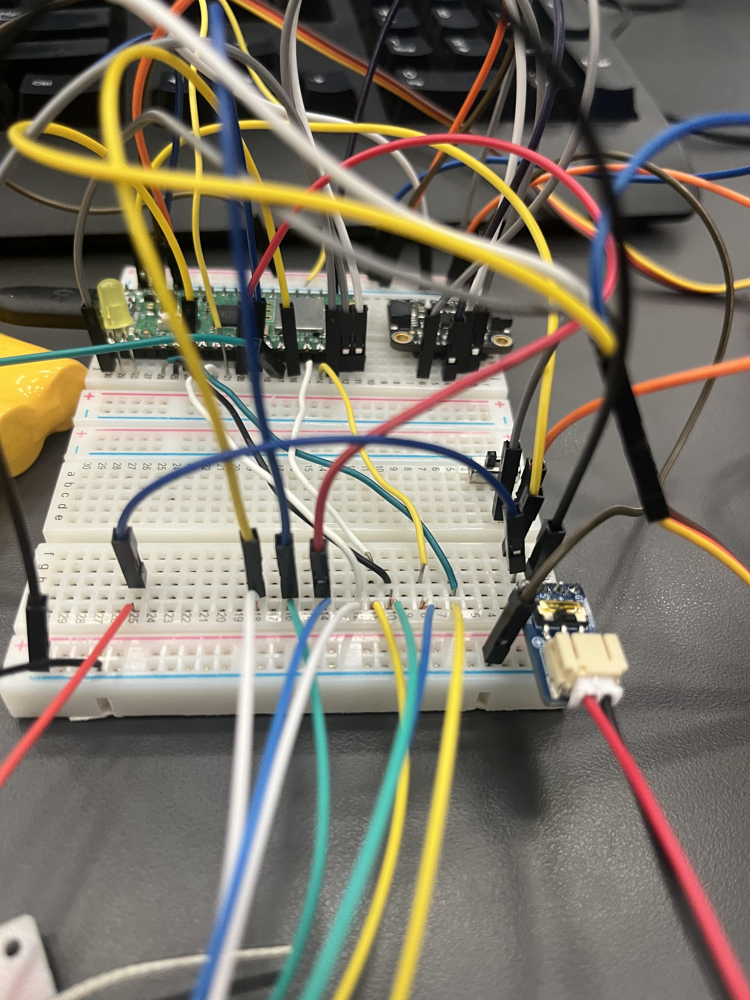

# PLAIN
(**P**)ropelled (**L**)inkage (**A**)ircraft (**I**)ntercommunication (**N**)ighthawk

 

## Table of Contents
* [Planning](Planning.md)
* [Phase 0](#phase_0)
* [Phase 1](#phase_1)
* [Phase 2](#phase_2)
* [Phase 3](#phase_3)
* [Phase 4](#phase_4)
* [Launching](#launching)
* [Analysis](#analysis)

 

## Phase_0
### Week 1
#### Reflection

This week we worked on our planning document. We created, outlined, and filled in most of our google doc. We drew up our first sketches and calculated the cost of parts while also starting to outline our timeline. This week was mainly talking with Afton's group and brainstorming how we wanted to do the linkage.

#### Images

### Week 2
#### Reflection

This week we completed our planning document. We finished the timeline, code blocks, and the rest of the google doc. Then we created a github repo and moved all of the information from the doc to the github planning document. We fleshed out a more concrete plan with aftons group and made our schedueles so that there was a lot of overlap and we would check in every now and then. 

#### Images

### Week 3
#### Reflection

This week we prototyped the PLAIN with shop materials. Vinnie was out sick this week so Matthias had to take charge and created our prototype. Matthias made it out of wood, styrofoam, a 9v battery, and a motor. The prototype did not fly and was not areodynamic at all. The only thing that worked was the switch that was soldiered to the motor and turned it on. We decided that it was best to move on with the project and not waste too much time trying to made a working prototype. 

#### Images

## Phase_1
### Week 4
#### Reflection

This week we worked together to make the first prototype in CAD. A general style was followed rather than planning for real world functionality. The only thing that was made to realistic standards was the air foil of the aft horizontal stabilizers. The air foil was made with a spline and modeling a common RC plane air foil.

#### Images

### Week 5
#### Reflection

This week Vinnie started the code, and as a proof of concept he wanted to wire a potentiometer to a motor and have it cotrol the speed using the map function. He also orderd the RC components to hopefully start working on it ASAP. Matthias started a new CAD design and thought it would be a good idea to make the fuselage deign layer by layer and then connect them by two pins.

#### Images

### Week 6
#### Reflection

This week we cut and built the prototype for the rib design. The laser printed pins didn't fit tightly all the way through and there was no plan on how to connect the wings so it turned out just to be a losely fitting body. Vinnie also worked on getting the RC to function and eventually got a succesful wireless conection and it turned on lights on command. It was hard initially because he didn't know to pullup or to pulldown and forgot that it would function the same a normal button.   

#### Images

## Phase_2
### Week 7
#### Reflection

This week Matthias tried to fix the prototype while Vinnie worked on getting the RC to give signals that he was able to recieve and use as inputs in his code. The rib prototype did not end up looking redeemable to matthias and after much frustration it was scrapped. Vinnie got a servo to be able to turn using only RC as inputs. He used code from earlier in the year to make the process easier. 

#### Images

### Week 8
#### Reflection

This week Matthias tried a new cad design that HIGHLY resembled a neighboring groups CAD. Aside from the apparent problems, the biggest one was that the design he was "inspired by" was meant to be a glider and in no way had the design intention of gaining speed and producing lift with a motor. Vinnie continued working with the RC and expirimented with the wiring. He also ordered the motor so that he could start working on it. 

#### Images

## Phase_3
### Week 9
#### Reflection

This week we were supposed to work on linkage with Afton's team but both of our groups were not ready to link yet. Matthias scrapped the copycat design and then started working on a more solid design that we will hopefully use in the final version. Vinnie started working on voltage dividers so there could be one power source that powers the pico and motors together. This required much googling and circuit planning.

#### Images

### Week 10
#### Reflection

This week we were supposed to code the delink protocol and complete the prototype with link. Neither of these things happened because Matthias was still working on his design for CAD and hadn't laser cut it yet. Vinnie was still working on the voltage dividers and experimenting with Mr. Miller's resitor book with many different types of resistors. Matthias also put the servo mount on to the bottom of the wings so that it would be easy to control the flap movement, this idea was also used by Matthew and Afton on their first iteration.

#### Images

### Week 11
#### Reflection

This week we were supposed to touch up the delink/motor/rc, figuring out weight, first successful solo flights. None of these were acheivable. The link had not been finished, yet alone started with Afton's group. The motor came but Vinnie was busy trying to figure out voltage dividers. The RC needed the motor to be finished, and the PLAIN hadn't been fabricated so the weight and flight could not be acheived. This week matthias got closer to the finished product in CAD and Vinnie realized he didn't actually need the voltage divider from the 9v because the actual motor needed many more amps than a 9v with many outputs had to offer. Vinnie started to catch up on the documentation. 

#### Images

## Phase_4
### Week 12
#### Reflection

This week we were supposed to plan with Afton’s team for linked takeoff but we could neither link nor takeoff. Matthias worked on the last weight reductions and was close to done. Vinnie kept working on the documentaion and caught up to the current date. Vinnie also searched the back for a battery and charger that they could use in the PLAIN. 

#### Images

### Week 13
#### Reflection

This week we decided to scrap the connection launch because both teams were to far behind to have enough time to test and get good results. Matthias worked on making the wings thinner and hopefully reducing the weight of the plain overall, the wing change was also realized because we did not need such a tall airfoil and the length was going to be more important. This was achieved by changing the shape of the airfoil making every part of the airfoil 1mm thick. Vinnie started setting up the motor and soldered the right connector on the battery so that it worked with the motor. He started looking online for the code for the specific motor and found a few examples.

#### Images

### Week 14
#### Reflection

This week we both decided it would be a good idea to move on from the round design of our fusalage to a more square design that would be both easier to make and would allow for all of our electronics to fit better in the fusalage and have a better centre of mass. Matthias also found a new design that we agreed was a good idea to model off of. With the new design Matthias decided to move the servos onto the fusalage and put the wings onto the top of the plain which we believe would allow for more lift. This week Vinnie got his wisdom teeth removed so he was not able to work on the PLAIN.

#### Images

### Week 15
#### Reflection

This week Matthias worked on readjusting the plain to make it more aerodynamic and changing the way that the front was angled and adding more supports for the wing connection. Additionally, Matthias put on the back of the fusalage and used a friction fit design which incorperated a 2.45mm diameter metal rods in order to connect the peices together. Matthias used both sketches and fillets in order to make the plain more aerodynamic and also had trouble because the bottom corners of the fuslage were too thin so he had to add a little more filling on the inside of the plain, he did this by using a conic as the top and using the bottom edge of the fuselage to create a sketch then extruded that sketch 2mm into the fuslage to fix the thin issue. This week Vinnie got the motor code working and was able to turn on the motor with the remote control. The code made it so that one button increased the value from 50(rest) to 100(full trottle) by 1 per 0.05 seconds and then decrease by .75 per 0.05 seconds if a second button was pressed. The hardest part was figuring out how to format the motor controller in the code and it required a line that said: dval = int(val)*65535/100. This line converted from bianary to a value the motor controller could use.  

#### Images

## Launching
### Week 16
#### Reflection

This week Matthias and Vinnie went to texas and visited Big Bend national park for spring break. 

#### Images

### Week 17
#### Reflection

We were not ready for launching because we didn't print yet. The code part wasn't done either and was still in the breadboard stage. This week Matthias finished up some last kinks on the PLAIN in order to have printed parts by next week. Matthias pushed out the friction fit connector on the back fusalage all the way to 11mm and on the front to 31mm in order to maximize the connection aspect from both ends. Vinnie worked on setting up the servos to work with the RC controller. He got two servos attached and then was able to make both them go towards 180 with a button on the controller and both go towards 0 with a second button. The setup was not that tricky and he used old servo code from earlier in the project which worked fine. 

#### Images

 

### Week 18
#### Reflection

This week we got closer to the final product. The CAD was printed over the weekend and the code was moving along. As the parts were printed Matthias noticed some things were not working right. this was expected from our first draft, one thing Matthias immediately recognized was the the flaps would not be able to rotate very well and it would be hard to put them into the wings the way it was designed. Matthias decided the change the design in order to make it rotate better through the use of hinge pin design(seen below). This method needed to have a rod in the middle of the pins in order to make the rotation perfect so Matthias used one of the rods given to him by matthew. Vinnie worked on finishing the data collecting part of the project. After he completed and tested the data collection then the code was finally done. He forgot how the data collection software needed to be used and had to spend some time reviewing the old assignment. 

#### Images

## Analysis
### Week 19
#### Reflection

We could not analize what we didn't have, so we continued to try and finish the PLAIN. This week we printed the CAD and worked on assembling it. The friction fits didn't quite work and we had to use hot glue to get the rods to fit. We also accidently printed two left wings which made the PLAIN unable to be assembled completely. There were also no holes for the wires from the motor to enter through the front back into the cockpit to connect with the PICO. [matthias reflection here} Vinnie took pictures of the wiring so that he could start soldering the permanant board together so that it would fit in the PLAIN. 

#### Images

### Week 20
#### Reflection

This week we printed the correct set of wings. With all the parts finally materialized we could put it together for real. We threw the completed PLAIN shell back and forth to test the lift and even without the extra weight from the circuit board it did not glide at all. This is when we realized we might have a problem. [matthias reflection here}. Vinnie worked on the wiring for the project and came in during his 6th period in order to have more time to work. He got almost all the wiring done and just had to add one more servo. The main problem for Vinnie was not being able to find the small needle nose pliers the lab to assist with soldering the wires. His patients was also tested when certain wires wouldn't soldier together without springing away. Sometimes he used his fingers which hurt. 

#### Images

### Week 21
#### Reflection

This week we still held out hope for the printed shell to work with the electronics, which was honestly a waste of time. We put the finished electronics in the shell and the weight alone was a red flag. We did a couple practice tosses to eachother and it was the same as throwing a baseball; there was no lift whatsoever. [matthias reflection here). Vinnie finished the circuit and had fully fabricated all the the compenents. He tested the hardware and it worked when plugged into the computer, but when it was running off of the battery there was not enough power to keep everything running. He then figured out that he needed to send the motor control power through the pico instead of straight from the battery which drew too many amps because of the way it was hooked up. At the end of the week the system was fully funtioning off of the batteries and could be controlled anywhere. Vinnie also created a plane out of cardboard, duct tape, and dowles as a joke. (foreshadowing)

#### Images

### Week 22
#### Reflection

This week no work got done Because of the AP exams

#### Images

### Week 23
#### Reflection

This week we realized that if we didn't have a succesful flight, we would get a C. This forced us to decide to use the cardboard plane as our final project. The plane glided fairly well and was big enough to support the extra weight of the pico and batteries. [matthias reflection here -motor mount-}. Vinnie focused on cutting out a hole for the pico and battery on the main wings in order to keep the center of mass in the same spot it was before the extra hardware was added. Once the motor mount was printed we found out that the holes were a little too close together, so we used the drill to make the holes bigger and then used bolts with a small radius at an angle to get away with the holes still not being perfectly lined up. We then test launched a couple of times, the first being very succesful until the motor stalled. The second one was thrown with a downward angle and went straight into the ground and broke the propeller. It was evaluated that the motor stalling was a voltage issue because the battery we had was rated 3-4 volts beneath the recommended battery voltage for our specific motor. Afton agreed to lend us an extra battery of his that met the recomended minimum voltage.   

#### Images

### Week 24
#### Reflection

This week we worked on catching up on the documentation and then rearranged the cockpit in order to fit the new battery.

#### Images

